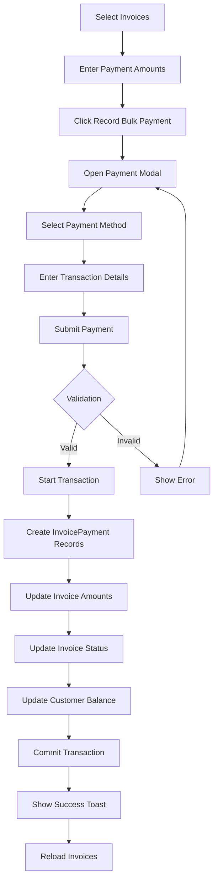

# Bulk Invoice Payment Feature - Complete Implementation Guide

## Overview

The Bulk Invoice Payment feature allows users to record payments for multiple customer invoices simultaneously. This feature is part of the Debtors (Accounts Receivable) module and follows modern accounting standards for payment processing.

## Architecture

### Backend (NestJS)

**Location**: `apps/backend/src/debtors/`

**Key Files**:

1. **debtors.service.ts** - Core business logic
   - `recordBulkPayment()` method (lines 410-550)
   - Validates customer, invoices, and payment amounts
   - Uses Prisma transactions for atomic operations
   - Updates invoice status, amounts, and customer balance

2. **debtors.controller.ts** - REST API endpoints
   - `POST /debtors/bulk-payment` - Records bulk payments
   - `GET /debtors/payment-methods` - Retrieves enabled payment methods
   - `GET /debtors/customer/:customerId/outstanding` - Gets outstanding invoices

3. **payment-methods.service.ts** - Payment methods management
   - Fetches enabled payment methods for the organization
   - Returns payment method configurations (code, name, display name, icon)

4. **debtors.dto.ts** - Data Transfer Objects
   - `RecordBulkPaymentDto` - Bulk payment request DTO
   - `BulkPaymentItemDto` - Individual payment item DTO
   - Validation using class-validator decorators

### Frontend (Angular)

**Location**: `apps/frontend/src/app/modules/debtors/`

**Key Files**:

1. **outstanding-invoices.component.ts** - Main component
   - Displays customer invoices with balances
   - Multi-select invoices for payment
   - Payment amount input per invoice
   - Bulk payment modal with payment details

2. **debtors.service.ts** - HTTP service
   - `recordBulkPayment(dto)` - Sends payment to backend
   - `getPaymentMethods()` - Fetches enabled payment methods
   - `getCustomerOutstandingInvoices(customerId)` - Gets invoices

3. **debtors.types.ts** - TypeScript interfaces
   - Type definitions matching backend DTOs
   - Ensures type safety across frontend

## Features

### 1. Multi-Invoice Selection

- ✅ Checkbox selection for multiple invoices
- ✅ Visual summary of selected invoices
- ✅ Total payment amount calculation
- ✅ Individual payment amount adjustments

### 2. Payment Processing

- ✅ Payment method selection (from configured methods)
- ✅ Transaction code/reference (optional)
- ✅ Payment date selection
- ✅ Additional notes
- ✅ Recorded by (auto-filled from current user)

### 3. Validation

- ✅ Payment amount cannot exceed balance due
- ✅ Payment method required
- ✅ Customer ownership verification
- ✅ Invoice status validation (not cancelled)

### 4. Atomic Transactions

- ✅ All payments processed in a single database transaction
- ✅ Rollback on any failure
- ✅ Consistent data updates

### 5. Invoice Updates

- ✅ Updates `amountPaid` for each invoice
- ✅ Recalculates `balanceDue`
- ✅ Sets `fullyPaid` flag when balance is zero
- ✅ Updates status: `PARTIALLY_PAID` or `PAID`
- ✅ Sets `paidAt` timestamp when fully paid

### 6. Customer Balance

- ✅ Decrements customer `dueCredit` by total paid amount
- ✅ Maintains accurate customer balance

### 7. Payment History

- ✅ Creates `InvoicePayment` record for each payment
- ✅ Links payment to invoice
- ✅ Stores payment method details
- ✅ Records transaction code and notes

## Payment Flow



## API Endpoints

### 1. Get Outstanding Invoices

```
GET /debtors/customer/:customerId/outstanding
```

**Response**:

```json
{
  "customer": {
    "id": 1,
    "fullName": "John Doe",
    "phoneNumber": "+254700000000",
    "email": "john@example.com"
  },
  "invoices": [
    {
      "id": 101,
      "invoiceNumber": "INV-2024-001",
      "issueDate": "2024-01-01",
      "dueDate": "2024-01-31",
      "totalAmount": 10000,
      "amountPaid": 3000,
      "balanceDue": 7000,
      "daysOverdue": 15,
      "agingCategory": "CURRENT",
      "payments": []
    }
  ],
  "summary": {
    "totalInvoices": 5,
    "totalOutstanding": 50000
  }
}
```

### 2. Get Payment Methods

```
GET /debtors/payment-methods
```

**Response**:

```json
[
  {
    "id": 1,
    "name": "Cash",
    "code": "CASH",
    "displayName": "Cash Payment",
    "requiresReference": false
  },
  {
    "id": 2,
    "name": "M-Pesa",
    "code": "MPESA",
    "displayName": "M-Pesa Mobile Payment",
    "requiresReference": true
  }
]
```

### 3. Record Bulk Payment

```
POST /debtors/bulk-payment
```

**Request**:

```json
{
  "customerId": 1,
  "payments": [
    {
      "invoiceId": 101,
      "amount": 5000
    },
    {
      "invoiceId": 102,
      "amount": 3000
    }
  ],
  "paymentMethodId": 1,
  "paymentMethodCode": "CASH",
  "paymentMethodName": "Cash Payment",
  "transactionCode": "TXN-12345",
  "paymentDate": "2024-01-15T10:00:00Z",
  "notes": "Partial payment for outstanding invoices",
  "recordedBy": "Jane Smith"
}
```

**Response**:

```json
{
  "success": true,
  "payments": [
    {
      "id": 501,
      "invoiceId": 101,
      "amount": 5000,
      "paymentDate": "2024-01-15T10:00:00Z"
    },
    {
      "id": 502,
      "invoiceId": 102,
      "amount": 3000,
      "paymentDate": "2024-01-15T10:00:00Z"
    }
  ],
  "summary": {
    "totalAmount": 8000,
    "invoiceCount": 2,
    "customer": {
      "id": 1,
      "fullName": "John Doe"
    }
  }
}
```

## Usage Guide

### For Developers

**1. Backend Integration**:

```typescript
// In your service
async processPayment(dto: RecordBulkPaymentDto) {
  const result = await this.debtorsService.recordBulkPayment(
    organizationId,
    dto
  );
  return result;
}
```

**2. Frontend Integration**:

```typescript
// In your component
import { DebtorsService } from '@shared/Services/debtors.service';

recordPayment() {
  const dto: RecordBulkPaymentDto = {
    customerId: this.customerId,
    payments: this.selectedPayments,
    paymentMethodCode: 'CASH',
    paymentMethodName: 'Cash',
    recordedBy: this.currentUser.name
  };

  this.debtorsService.recordBulkPayment(dto).subscribe({
    next: (response) => console.log('Success:', response),
    error: (error) => console.error('Error:', error)
  });
}
```

### For Users

**Step-by-Step Process**:

1. **Navigate to Outstanding Invoices**:
   - Go to Debtors > Customer Outstanding Invoices
   - Or click on a customer in the Aging Analysis report

2. **Select Invoices**:
   - Check the invoices you want to pay
   - Adjust payment amounts if needed (defaults to full balance)
   - View total selected amount in the summary card

3. **Record Payment**:
   - Click "Record Bulk Payment" button
   - Select payment method from dropdown
   - Enter transaction code (if applicable)
   - Choose payment date (defaults to today)
   - Add any notes
   - Click "Record Payment"

4. **Confirmation**:
   - Success toast notification appears
   - Invoice list refreshes automatically
   - Paid invoices are updated or removed from the list

## Database Schema

### InvoicePayment Model

```prisma
model InvoicePayment {
  id                  Int                  @id @default(autoincrement())
  invoiceId           Int
  invoice             Invoice              @relation(fields: [invoiceId], references: [id])
  organizationId      Int
  paymentMethodId     Int?
  paymentMethodConfig PaymentMethodConfig? @relation(fields: [paymentMethodId], references: [id])
  paymentMethod       PaymentMethod        // Enum
  paymentMethodCode   String?
  paymentMethodName   String?
  amount              Float
  transactionCode     String?
  paymentDate         DateTime             @default(now())
  notes               String?
  recordedBy          String
  createdAt           DateTime             @default(now())
  updatedAt           DateTime             @updatedAt
}
```

### Invoice Model (Relevant Fields)

```prisma
model Invoice {
  id          Int      @id @default(autoincrement())
  totalAmount Float
  amountPaid  Float    @default(0)
  balanceDue  Float
  fullyPaid   Boolean  @default(false)
  status      InvoiceStatus
  paidAt      DateTime?
  payments    InvoicePayment[]
}
```

### Customer Model (Relevant Fields)

```prisma
model Customer {
  id        Int     @id @default(autoincrement())
  fullName  String
  dueCredit Float   @default(0)
  invoices  Invoice[]
}
```

## Error Handling

### Backend Validation Errors

```typescript
// Customer not found
throw new NotFoundException("Customer not found");

// Invoice not found or doesn't belong to customer
throw new BadRequestException(
  `Invoice #${invoiceId} not found or does not belong to this customer`,
);

// Payment exceeds balance
throw new BadRequestException(
  `Payment amount ${amount} exceeds balance due ${invoice.balanceDue}`,
);

// Invoice is cancelled
throw new BadRequestException("Cannot process payment for cancelled invoice");
```

### Frontend Error Handling

```typescript
this.debtorsService
  .recordBulkPayment(dto)
  .pipe(
    this.toast.observe({
      loading: "Recording payments...",
      success: "Payments recorded successfully",
      error: (error) => {
        return error.error?.message || "Failed to record payments";
      },
    }),
  )
  .subscribe({
    next: (response) => this.handleSuccess(response),
    error: (error) => this.handleError(error),
  });
```

## Security

### Authentication

- ✅ All endpoints protected by `JwtGuard`
- ✅ User must be logged in to access

### Authorization

- ✅ Organization-based data isolation
- ✅ Users can only access their organization's data
- ✅ Invoice ownership verification

### Data Validation

- ✅ DTO validation using class-validator
- ✅ Type checking with TypeScript
- ✅ Amount validation (positive, not exceeding balance)

## Performance Considerations

### Database Optimization

- ✅ Single transaction for all operations
- ✅ Batch inserts for payment records
- ✅ Indexed queries on invoiceId, customerId
- ✅ Efficient customer balance calculation

### Frontend Optimization

- ✅ Lazy loading of components
- ✅ Reactive state management
- ✅ Debounced search inputs
- ✅ Efficient change detection

## Testing

### Backend Tests (Example)

```typescript
describe("DebtorsService - recordBulkPayment", () => {
  it("should record bulk payment successfully", async () => {
    const dto: RecordBulkPaymentDto = {
      customerId: 1,
      payments: [
        { invoiceId: 1, amount: 5000 },
        { invoiceId: 2, amount: 3000 },
      ],
      paymentMethodCode: "CASH",
      paymentMethodName: "Cash",
      recordedBy: "Test User",
    };

    const result = await service.recordBulkPayment(1, dto);

    expect(result.success).toBe(true);
    expect(result.summary.totalAmount).toBe(8000);
    expect(result.payments).toHaveLength(2);
  });

  it("should throw error if payment exceeds balance", async () => {
    const dto: RecordBulkPaymentDto = {
      customerId: 1,
      payments: [{ invoiceId: 1, amount: 999999 }],
      paymentMethodCode: "CASH",
      paymentMethodName: "Cash",
      recordedBy: "Test User",
    };

    await expect(service.recordBulkPayment(1, dto)).rejects.toThrow(
      BadRequestException,
    );
  });
});
```

### Frontend Tests (Example)

```typescript
describe("OutstandingInvoicesComponent", () => {
  it("should calculate total selected amount correctly", () => {
    component.selectedInvoices.set(1, 5000);
    component.selectedInvoices.set(2, 3000);

    expect(component.getTotalSelectedAmount()).toBe(8000);
  });

  it("should validate payment method selection", () => {
    component.selectedPaymentMethod = null;
    component.recordBulkPayment();

    expect(toast.error).toHaveBeenCalledWith("Please select a payment method");
  });
});
```

## Future Enhancements

### Planned Features

- [ ] Payment receipts generation (PDF)
- [ ] Email receipts to customers
- [ ] Payment reminders for overdue invoices
- [ ] Partial payment plans
- [ ] Payment allocation preferences (oldest first, etc.)
- [ ] Refund/reversal functionality
- [ ] Payment reconciliation with bank statements
- [ ] Multi-currency support
- [ ] Payment gateway integration

### Integration Possibilities

- [ ] M-Pesa STK Push integration
- [ ] Bank API integration for direct payments
- [ ] QuickBooks/Xero sync
- [ ] SMS payment confirmations
- [ ] WhatsApp payment receipts

## Troubleshooting

### Common Issues

**1. Payment methods not loading**:

- Check if PaymentMethodConfig is properly seeded
- Verify organization has enabled payment methods
- Check network tab for API errors

**2. Payment validation errors**:

- Ensure payment amount doesn't exceed balance due
- Verify invoice belongs to the selected customer
- Check invoice is not in CANCELLED status

**3. Transaction failures**:

- Check database connection
- Verify Prisma schema is up to date
- Review server logs for specific errors

**4. UI not updating after payment**:

- Verify API response is successful
- Check if `loadOutstandingInvoices()` is called
- Ensure component state is reactive

## Support

For issues or questions:

1. Check the error logs in browser console and server logs
2. Verify database schema matches the models
3. Ensure all migrations are run
4. Review API response in Network tab
5. Contact development team with specific error messages

## Conclusion

The Bulk Invoice Payment feature provides a comprehensive, secure, and user-friendly solution for recording customer payments across multiple invoices. It follows accounting best practices, ensures data integrity through transactions, and provides excellent user experience with real-time validation and feedback.
